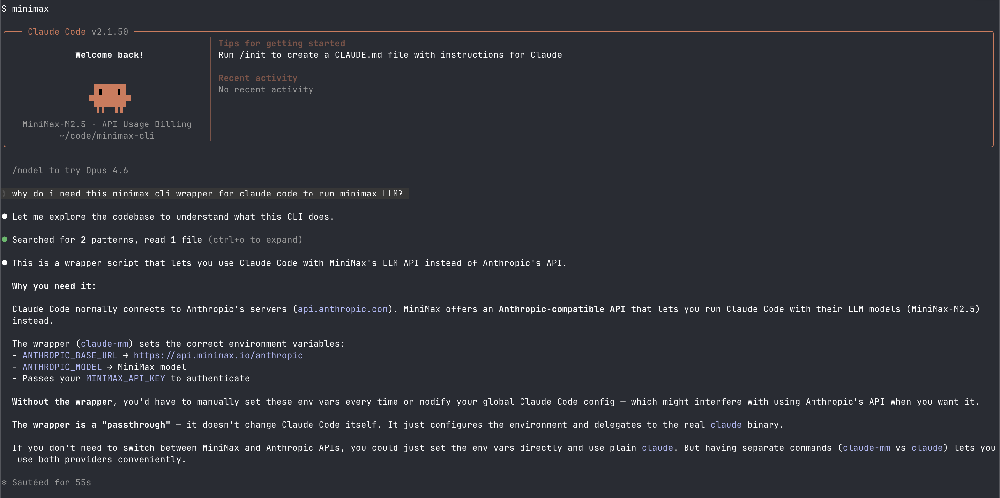

# minimax-cli

Run Claude Code on MiniMax without changing your default `claude` setup.

Codex support in this wrapper is currently paused.

## Install (30 seconds)

```bash
curl -fsSL https://github.com/harley/minimax-cli/releases/latest/download/install.sh | bash
export MINIMAX_API_KEY="your_minimax_key"
minimax
```

What this gives you:

- `minimax`: Claude-first entrypoint for MiniMax.
- `claude-mm`: Claude Code wrapper pinned to MiniMax Anthropic-compatible endpoint.
- `codex-mm`: compatibility command that currently reports Codex as unsupported in this wrapper.

## Screenshots

Drop your screenshot at this path:

- `assets/screenshots/claude-mm.png`

| Claude Code on MiniMax |
| --- |
|  |

## Quick Verify

```bash
minimax --help
claude-mm --help
codex-mm
```

Expected `codex-mm` output includes:

```text
Codex support in minimax-cli is temporarily unavailable.
https://platform.minimax.io/docs/coding-plan/codex-cli
```

## Prerequisites

- Bash (macOS/Linux shell)
- `claude` CLI installed
- MiniMax API key

## Usage

### `minimax`

```bash
minimax [claude arguments]
minimax claude [arguments]
minimax codex [arguments]
```

Examples:

```bash
minimax
minimax -p "Explain this repository"
minimax claude -p "Explain this repository"
minimax codex
```

Behavior:

- No args: runs `claude-mm`.
- `minimax claude ...`: runs `claude-mm ...`.
- `minimax codex ...`: exits non-zero with Codex paused message and docs URL.
- Any other first arg: forwards full args to `claude-mm`.

### `claude-mm`

```bash
claude-mm [claude arguments]
```

Examples:

```bash
claude-mm
claude-mm -p "Explain this project"
```

Defaults:

- Base URL: `https://api.minimax.io/anthropic`
- Model family vars: `MiniMax-M2.5`

Environment variables:

- `MINIMAX_API_KEY` (required)
- `MINIMAX_CLAUDE_BASE_URL` (optional)
- `MINIMAX_CLAUDE_MODEL` (optional)

### `codex-mm`

`codex-mm` is kept as an installed compatibility command. It currently exits with status code `2` and points users to:

- https://platform.minimax.io/docs/coding-plan/codex-cli

## Codex Status

Codex is currently not supported by this wrapper. Use the official MiniMax Codex guide:

- [MiniMax Codex CLI setup](https://platform.minimax.io/docs/coding-plan/codex-cli)

## Install Options

Default destination is `~/.local/bin`.

```bash
# show installer help
curl -fsSL https://github.com/harley/minimax-cli/releases/latest/download/install.sh | bash -s -- --help

# custom bin directory
curl -fsSL https://github.com/harley/minimax-cli/releases/latest/download/install.sh | \
  bash -s -- --bin-dir /usr/local/bin

# copy files instead of symlinks
curl -fsSL https://github.com/harley/minimax-cli/releases/latest/download/install.sh | \
  bash -s -- --copy
```

Source checkout fallback:

```bash
git clone https://github.com/harley/minimax-cli.git
cd minimax-cli
./install.sh
```

Uninstall:

```bash
rm -f ~/.local/bin/minimax ~/.local/bin/codex-mm ~/.local/bin/claude-mm
```

## Troubleshooting

- `Error: MINIMAX_API_KEY is not set`
  - Set `MINIMAX_API_KEY` before running wrappers.
- `claude CLI not found`
  - Install Claude Code and ensure it is in `PATH`.
- `codex-mm` or `minimax codex` reports unsupported
  - This is expected for now. Follow MiniMax Codex docs:
    https://platform.minimax.io/docs/coding-plan/codex-cli

## Official MiniMax Docs

- [MiniMax Claude Code setup](https://platform.minimax.io/docs/coding-plan/claude-code)
- [MiniMax Codex CLI setup](https://platform.minimax.io/docs/coding-plan/codex-cli)

## Development

```bash
./bin/ci
```

Release automation:

- `release-please` workflow: `.github/workflows/release-please.yml`
- Release asset upload workflow: `.github/workflows/release-install.yml`
- Commit messages should use Conventional Commits (`feat:`, `fix:`, etc.)

## Security Notes

- Do not commit API keys.
- Prefer shell profile exports or a local `.env` file loaded by your shell.
